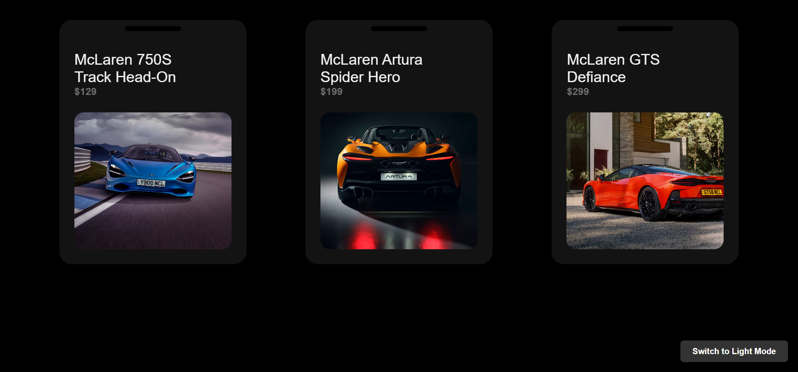

# Task 1 – Unique Product Card Design

This project showcases a unique product card design with a dark mode toggle feature. The product cards display information about various McLaren cars, including their images, names, prices, and descriptions.

## Features

- **Product Cards**: Each card displays the product image, name, and price on the front. The back of the card shows a detailed description and a "Buy Now" button.
- **Dark Mode**: A toggle button allows users to switch between light and dark modes. Dark mode is enabled by default.

## Files

- `index.html`: The main HTML file that contains the structure of the webpage.
- `style.css`: The CSS file that styles the product cards and the dark mode toggle button.
- `script.js`: The JavaScript file that dynamically generates the product cards and handles the dark mode toggle functionality.
- `image.png`, `McL750S_Track_HeadOn.webp`, `MCLAREN_ARTURA_SPIDER_HERO.webp`, `McLaren_GTS_Defiance-009.webp`: Image files used in the product cards.

## How to Run

1. Open the `index.html` file in a web browser.
2. The webpage will load with dark mode enabled by default.
3. Click the "Toggle Dark Mode" button at the bottom right corner to switch between light and dark modes.

## Screenshots

## License

This project is licensed under the MIT License.