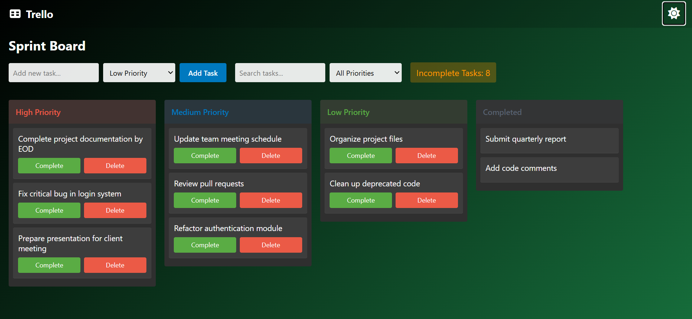

# Task 2 – Interactive To-Do List with Priority Management

This project is an interactive to-do list application where users can add, delete, and prioritize tasks dynamically. The tasks are categorized by priority levels, and users can mark tasks as completed, moving them to a separate section.

## Features

- **Add Tasks**: Users can add tasks with a name and a priority level (High, Medium, Low).
- **Display Tasks**: Tasks are displayed dynamically using `map()` and grouped by priority.
- **Complete Tasks**: Each task has a "Complete" button to move it to the completed list.
- **Delete Tasks**: Clicking "Delete" removes a task from the list.
- **Task Count**: Uses `reduce()` to display the total number of incomplete tasks.
- **Search & Filter**: Users can search tasks by name and filter tasks by priority.
- **Dark Mode**: A toggle button allows users to switch between light and dark modes.

## Files

- `index.html`: The main HTML file that contains the structure of the webpage.
- `style.css`: The CSS file that styles the to-do list and the dark mode toggle button.
- `script.js`: The JavaScript file that dynamically manages tasks and handles the dark mode toggle functionality.
- `image.png`, `image-1.png`: Image files used in the project.

## How to Run

1. Open the `index.html` file in a web browser.
2. The webpage will load with the to-do list application.
3. Use the input fields to add tasks, search tasks, and filter tasks by priority.
4. Click the "Toggle Dark Mode" button at the top right corner to switch between light and dark modes.

## Screenshots

## License

This project is licensed under the MIT License.