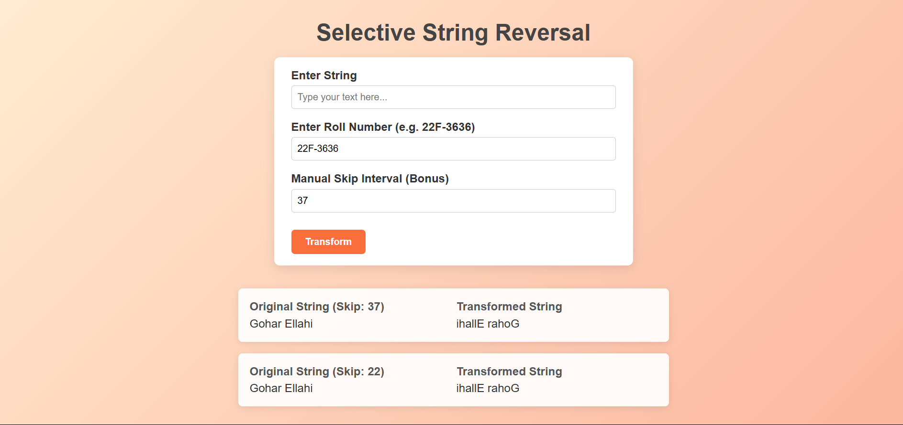

# Task 3 – Selective String Reversal

This project is a web application that allows users to selectively reverse a string based on a skip interval. The skip interval can be derived from the sum of digits in a roll number or manually specified by the user.

## Features

- **Input String**: Users can enter a string to be transformed.
- **Roll Number**: Users can enter a roll number (e.g., 22F-3636) to calculate the skip interval.
- **Manual Skip Interval**: Users can optionally specify a manual skip interval.
- **Transform Button**: Transforms the input string based on the skip interval.
- **Results List**: Displays the original and transformed strings along with the skip interval used.

## Files

- `index.html`: The main HTML file that contains the structure of the webpage.
- `style.css`: The CSS file that styles the form and results list.
- `script.js`: The JavaScript file that handles the string transformation logic and DOM manipulation.
- `image.png`: An image file used in the project.

## How to Run

1. Open the `index.html` file in a web browser.
2. Enter a string in the "Enter String" input field.
3. Enter a roll number in the "Enter Roll Number" input field (e.g., 22F-3636).
4. Optionally, enter a manual skip interval in the "Manual Skip Interval" input field.
5. Click the "Transform" button to see the transformed string in the results list.

## Screenshots

## License

This project is licensed under the MIT License.