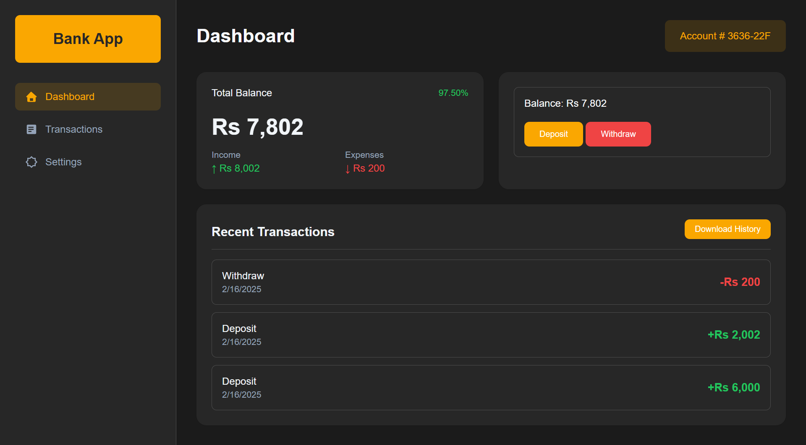
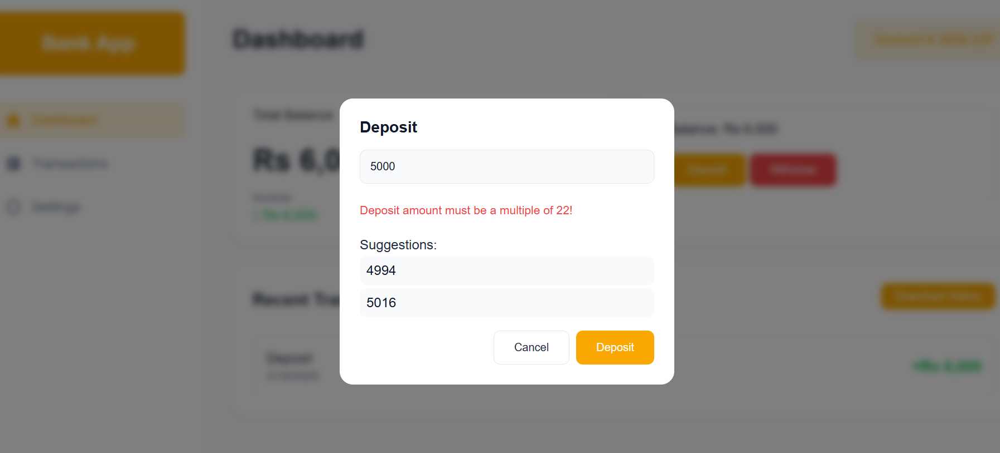
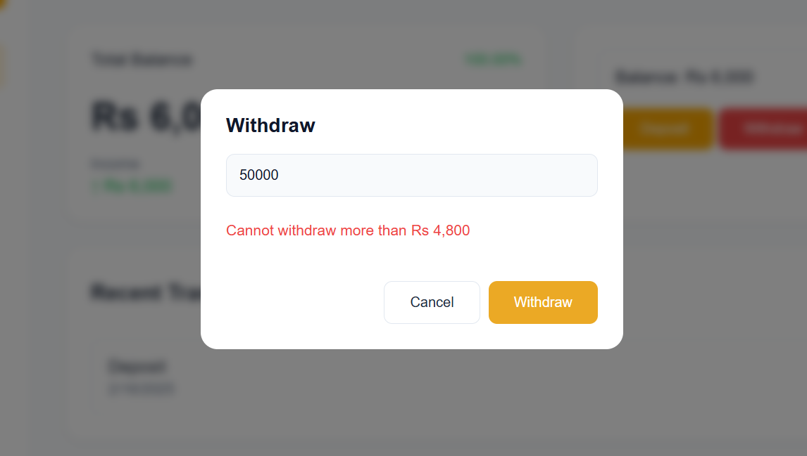

# Task 4 – Bank Account System

This project is a web application that simulates a bank account system. Users can deposit and withdraw money, view their transaction history, and see their account balance. The application also includes a dark mode toggle and allows users to download their transaction history.

## Features

- **Deposit and Withdraw**: Users can deposit and withdraw money from their account.
- **Transaction History**: View a list of all transactions with details such as type, amount, and date.
- **Account Balance**: Display the current account balance, total income, and total expenses.
- **Dark Mode**: A toggle button allows users to switch between light and dark modes.
- **Download History**: Users can download their transaction history as a text file.
- **Settings**: Users can update the bank name and switch between pages (Dashboard, Transactions, Settings).

## Files

- `index.html`: The main HTML file that contains the structure of the webpage.
- `style.css`: The CSS file that styles the bank account system and the dark mode toggle button.
- `script.js`: The JavaScript file that handles the bank account logic, DOM manipulation, and dark mode toggle functionality.
- `image.png`, `image-1.png`, `image-2.png`, `image-3.png`: Image files used in the project.

## How to Run

1. Open the `index.html` file in a web browser.
2. The webpage will load with the bank account system.
3. Use the buttons to deposit or withdraw money, view transaction history, and switch between light and dark modes.
4. Use the settings page to update the bank name and download the transaction history.

## Screenshots

## License

This project is licensed under the MIT License.