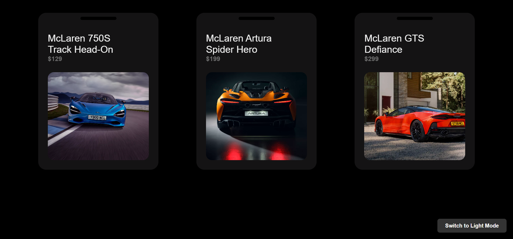
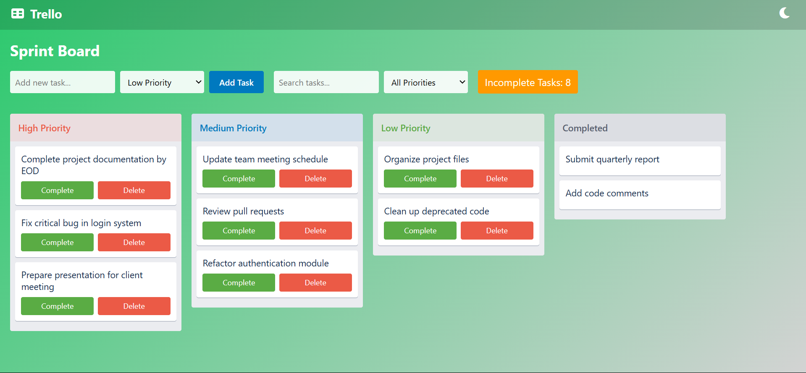
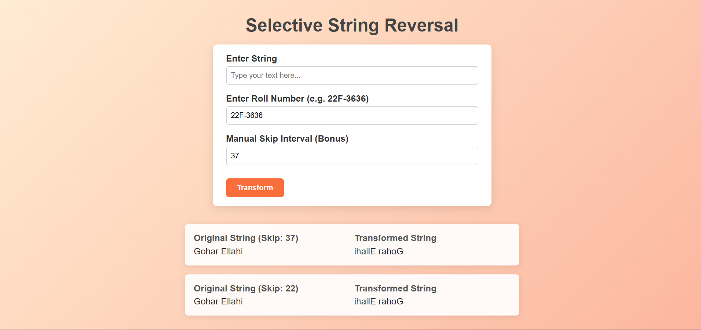
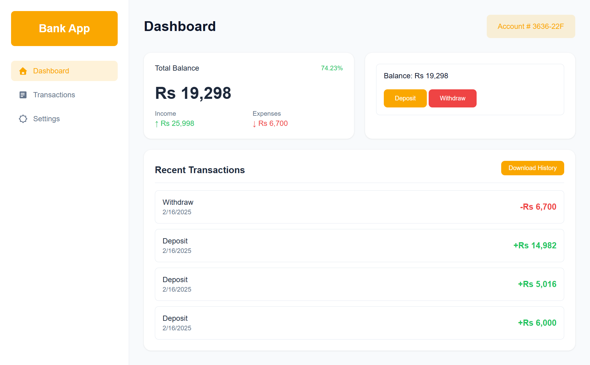
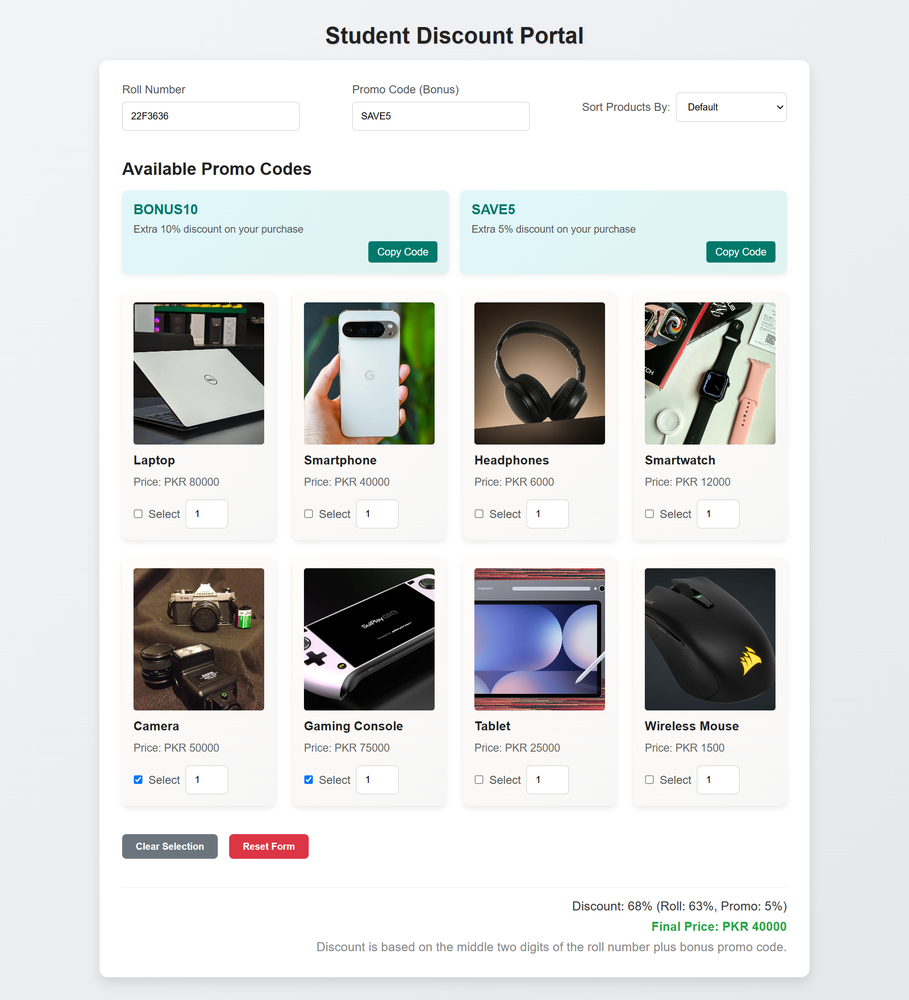

# Web Engineering Assignments

This repository contains a collection of web engineering assignments. Each assignment is implemented as a separate project with its own set of features and functionalities. Below is a brief overview of each assignment.

Demo Preview: 
    https://gellahi.github.io/Web_Projects_Collection_1.2/

## Assignments

### [Task 1 – Unique Product Card Design](Q1/index.html)

This project showcases a unique product card design with a dark mode toggle feature. The product cards display information about various McLaren cars, including their images, names, prices, and descriptions.

### [Task 2 – Interactive To-Do List with Priority Management](Q2/index.html)

An interactive to-do list application where users can add, delete, and prioritize tasks dynamically. The tasks are categorized by priority levels, and users can mark tasks as completed, moving them to a separate section.

### [Task 3 – Selective String Reversal](Q3/index.html)

This project allows users to selectively reverse a string based on a skip interval. The skip interval can be derived from the sum of digits in a roll number or manually specified by the user.

### [Task 4 – Bank Account System](Q4/index.html)

A web application that simulates a bank account system. Users can deposit and withdraw money, view their transaction history, and see their account balance. The application also includes a dark mode toggle and allows users to download their transaction history.

### [Task 5 – Roll-Number based Discount System](Q5/index.html)

This project allows users to select products, apply discounts based on their roll number, and use promo codes for additional discounts. The application dynamically calculates the final price based on the selected products and applied discounts.

## How to Run

1. Clone the repository to your local machine.
2. Navigate to the folder of the assignment you want to run.
3. Open the `index.html` file in a web browser.

## License

This project is licensed under the MIT License.